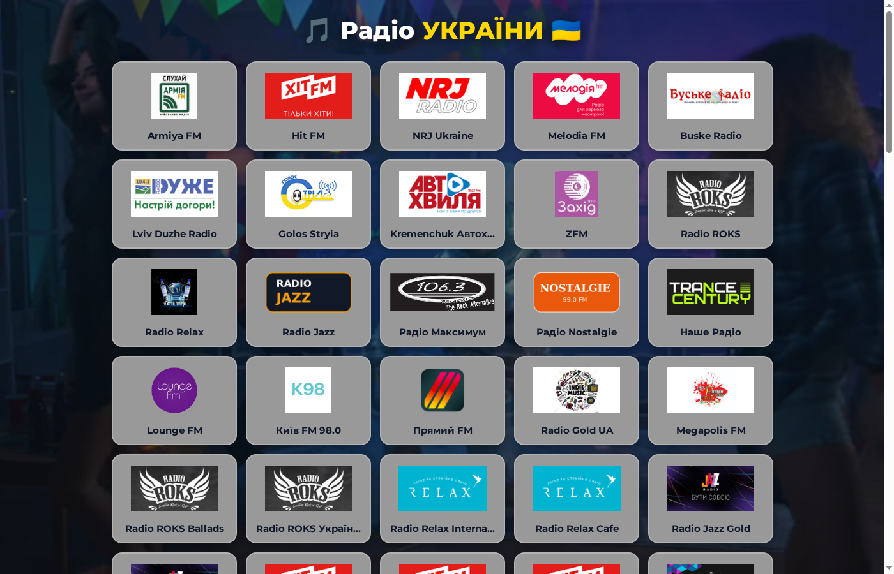

# 🎵 Радіо УКРАЇНИ (RadioJS)

<p align="center">
  <b>Сучасний веб-плеєр для комфортного онлайн-прослуховування українських радіостанцій</b><br>
  <i>Прямі безпечні HTTPS-потоки, якісні фірмові логотипи, динамічна неонова анімація та відсутність реклами.</i>
</p>

<p align="center">
  <a href="https://andriyveremchuck.github.io/RadioJS/"><strong>🌐 Відкрити Радіо Онлайн (GitHub Pages)</strong></a>
</p>

<p align="center">
  
</p>

---

## ✨ Особливості веб-сторінки

- 🇺🇦 **109 перевірених станцій:** Повний каталог популярних національних та регіональних українських радіостанцій (Hit FM, Kiss FM, Radio ROKS, NRJ, Radio Jazz, Байрактар, ТАКТ та багато інших).
- 🔒 **100% захищені HTTPS-потоки:** Усі аудіопотоки оптимізовані та транслюються через прямі захищені CDN без блокувань *Mixed Content* чи помилок браузера.
- 🎨 **Справжні логотипи:** Кожна радіостанція має чіткий фірмовий логотип з адаптивним підлаштуванням під картку.
- ⚡ **Миттєве відтворення:** Запуск і перемикання станцій в один клік без переривань і перезавантаження сторінки.
- 💫 **Живий неоновий інтерфейс:** Світлові відблиски, інтерактивна підсвітка та еквалайзер для активної радіостанції, делікатний фоновий відеоряд.
- 📱 **Повна адаптивність:** Зручно користуватися як на комп'ютері, так і на планшеті чи смартфоні.

---

## 🚀 Як користуватися

1. **Онлайн (без встановлення):**  
   Перейдіть за посиланням: [andriyveremchuck.github.io/RadioJS](https://andriyveremchuck.github.io/RadioJS/)
2. **Локально на комп'ютері:**  
   Відкрийте файл `index.html` у будь-якому сучасному браузері або запустіть локальний сервер:
   ```bash
   python3 -m http.server 8080
   ```
   та перейдіть за адресою `http://localhost:8080/`.

---

## 🛠 Технології

- **HTML5 Audio API** (нативне потокове відтворення аудіо)
- **CSS3 Grid & Flexbox** (адаптивна сітка, плавні переходи та неонові ефекти)
- **Vanilla JavaScript (ES6+)** (керування потоками, перевірка стану та авто-відновлення)
- **Векторна графіка SVG** (висока якість на retina-дисплеях)

---

## 📖 Ліцензія

Відкритий проєкт для вільного некомерційного використання.

---

**Створено для підтримки якісної української музики 🇺🇦🎶**

